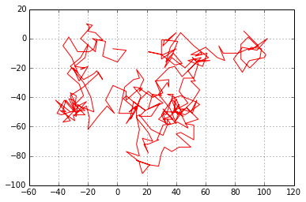
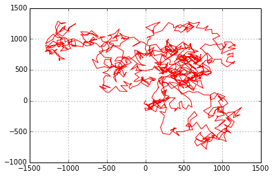
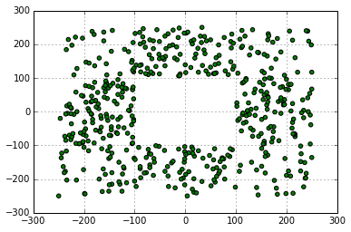
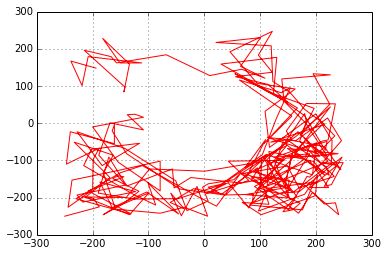

```python
import random
import matplotlib.pyplot as plt
import math
```


```python
import numpy as np
```


```python
%matplotlib inline
```


```python
def random_walk(n,t):
    x = 0
    y = 0
    xarray = [0]
    yarray = [0]
    for i in range(n):
#         step = random.choice(['N','S','E','W'])
#         if step == 'N':
#             y += random.randint(0,t)
      
#         elif step == 'S':
#             y -= random.randint(0,t)
           
#         elif step == 'E':
#             x += random.randint(0,t)
            
#         elif step == 'W':
#             x -= random.randint(0,t)
        x += random.randint(-t,t)
        y += random.randint(-t,t)
        xarray.append(x)
        yarray.append(y)
    return(x,y,xarray,yarray)
```


```python
walk = random_walk(300,10)
print('Distanse ', abs(walk[0])+abs(walk[1]))
arraymainX =  walk[2]
arraymainY =  walk[3]
print(len(arraymainX),len(arraymainY))
```

    ('Distanse ', 91)
    (300, 300)


Start DEF


```python
def showplot(TetX,TetY):
    plt.title = "Walk Random"
    plt.xtitle = "X"
    plt.ytitle = "Y"
    plt.grid(True)
    plt.plot(TetX,TetY,c='red')
    plt.figure(figsize=(1,1))
    # plt.plot(arraymain_sub_X,arratmain_sub_Y,'2',c='blue')
    plt.show()
    
def showscatter(TetX,TetY):
    plt.title = "Walk Random"
    plt.xtitle = "X"
    plt.ytitle = "Y"
    plt.grid(True)
    plt.scatter(TetX,TetY,c='green')
    plt.figure(figsize=(1,1))
    # plt.plot(arraymain_sub_X,arratmain_sub_Y,'2',c='blue')
    plt.show()
```


```python
print(len(arraymainX))
print(len(arraymainY))
```

    301
    301


```python
showplot(arraymainX,arraymainY)
```





    <matplotlib.figure.Figure at 0x10d822f50>


```python
walk = random_walk(100,10)
X,Y =  walk[2],walk[3]
showplot(X,Y)
```


    <matplotlib.figure.Figure at 0x10d830d50>


```python
def random_walk_border(n,t,b):
    x = 0
    y = 0
    xarray = [0]
    yarray = [0]
    for i in range(n):
        randomX = random.randint(-t,t)
        randomY = random.randint(-t,t)
#         abs(x+randomX)+abs(y+randomY)
#         math.sqrt((0-(x+randomX))**2+(0-(y+randomY))**2)
        while(x + randomX > b or x + randomX < b*-1 ):
            randomX = random.randint(-t,t)
        while(y + randomY > b or y + randomY < b*-1 ):
            randomY = random.randint(-t,t)
        x += randomX
        y += randomY
        xarray.append(x)
        yarray.append(y)
    return(x,y,xarray,yarray)
```


```python
new_border = random_walk_border(100,20,130)
X_B,Y_B =  new_border[2],new_border[3]
print('distanse ', abs(new_border[0])+abs(new_border[1]))
showplot(X_B,Y_B)
```

    ('distanse ', 95)


    <matplotlib.figure.Figure at 0x10d84dcd0>


```python
new_border = random_walk_border(100000,20,130)
X_B,Y_B =  new_border[2],new_border[3]
# ошибка
print('distanse ', math.sqrt(max(new_border[2])**2+max(new_border[3])**2))
showplot(X_B,Y_B)
```

    ('distanse ', 183.14202139323461)


    <matplotlib.figure.Figure at 0x10f519a90>


```python
new_border = random_walk_border(10000,10,130)
X_B,Y_B =  new_border[2],new_border[3]
# ошибка
print('distanse ', math.sqrt(max(new_border[2])**2+max(new_border[3])**2))
showplot(X_B,Y_B)
```

    ('distanse ', 182.43354954612926)


    <matplotlib.figure.Figure at 0x10c57d750>


```python
new_border = random_walk_border(1000,100,1300)
X_B,Y_B =  new_border[2],new_border[3]
# ошибка
print('distanse ', math.sqrt(max(new_border[2])**2+max(new_border[3])**2))
showplot(X_B,Y_B)
```

    ('distanse ', 1796.2522094628025)





    <matplotlib.figure.Figure at 0x10ed41710>


```python
new_border = random_walk_border(100000,300,1300)
X_B,Y_B =  new_border[2],new_border[3]
# ошибка
print('distanse ', math.sqrt(max(new_border[2])**2+max(new_border[3])**2))
showplot(X_B,Y_B)
```

    ('distanse ', 1838.4776310850236)


    <matplotlib.figure.Figure at 0x10f471950>


```python
def random_walk_border_INSIDE(n,t,b,xin,yin):
    x = -250
    y = -250
    xarray = [x]
    yarray = [y]
    for i in range(n):
        randomX = random.randint(-t,t)
        randomY = random.randint(-t,t)
        lastX = 0
        lastY = 0
        if(i > 1):
            lastX = xarray[i-1]
            lastY = yarray[i-1]   
        while(x + randomX > b or x + randomX < b*-1 or ((x + randomX >= -100 and x + randomX <= 100 ) and (y + randomY >= -100 and y + randomY <= 100 )) or (lastX <= -100 and x + randomX >= 100) or (lastX >= 100 and x + randomX <= -100) or (lastY >= 100 and y + randomY <= -100) or (lastY <= -100 and y + randomY >= 100) ):
            randomX = random.randint(-t,t)
        while(y + randomY > b or y + randomY < b*-1 or ((x + randomX >= -100 and x + randomX <= 100 ) and (y + randomY >= -100 and y + randomY <= 100 )) or (lastX <= -100 and x + randomX >= 100) or (lastX >= 100 and x + randomX <= -100) or (lastY >= 100 and y + randomY <= -100) or (lastY <= -100 and y + randomY >= 100) ):
            randomY = random.randint(-t,t)
        x += randomX
        y += randomY
        xarray.append(x)
        yarray.append(y)
    return(x,y,xarray,yarray)
```


```python
new_border = random_walk_border_INSIDE(500,300,250,[2,4],[-6,5])
X_B,Y_B =  new_border[2],new_border[3]
showscatter(X_B,Y_B)
# showplot(X_B,Y_B)
# задача чтобы точка не лежала в прямоугольнике и не проходил путь через него, подбор таких точек
```





    <matplotlib.figure.Figure at 0x10f89d250>


```python
new_border = random_walk_border_INSIDE(500,300,250,[2,4],[-6,5])
X_B,Y_B =  new_border[2],new_border[3]
# showscatter(X_B,Y_B)
showplot(X_B,Y_B)
# задача чтобы точка не лежала в прямоугольнике и не проходил путь через него, подбор таких точек
```


    <matplotlib.figure.Figure at 0x10f473c50>


```python
new_border = random_walk_border_INSIDE(300,100,250,[2,4],[-6,5])
X_B,Y_B =  new_border[2],new_border[3]
showscatter(X_B,Y_B)
showplot(X_B,Y_B)
```


    <matplotlib.figure.Figure at 0x10b1e11d0>





    <matplotlib.figure.Figure at 0x10af2e7d0>

